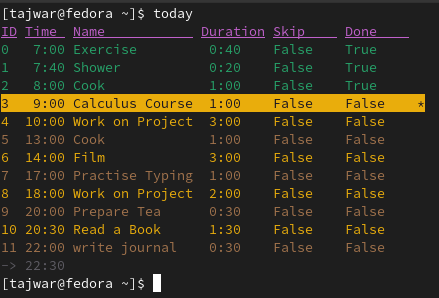
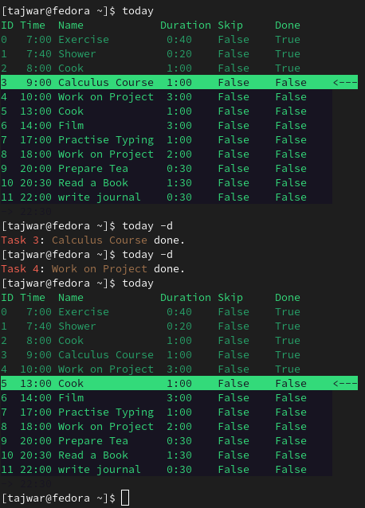

# today

**A terminal program to help you plan your day and execute it in an organised way**





# Getting Started

**today** is a day planner program written in *Python 3*. The intention of developing this program was to help people plan the tasks they are going take today with the amount of time they are planning to spend on them. This Command Line application will help you have a realistic idea of what you can do today and stay focused on your day plan throughout the day.

*today* has quite a few features. This short introduction will give you an idea of what this program is about and how to start using it.

To see how to install *today*, click [here](#Install today).

## the help message

Open your terminal. To see what we can do with this program, run the command below:

`today -h`

You should see a longer version of this help message:

```
positional arguments:
  Arguments            Task ID [int], Name [str], Duration [int]

options:
  -h, --help           show this help message and exit
  -a, --add            add/append a new Task [Name][Duration]
  -d, --done           mark a task as done [ID]
  -u, --undo           mark a task as undone [ID]
  -r, --remove         remove Task [ID]
  -t, --toggle         toggle Skip of Task [ID]
  -c, --settings       configure settings data
```

This is the shortened version of the help message for *today*. We will only be looking at what we need to know to get started using this program.

Let's say we woke up in the morning and the first task of our day will be to exercise for 40 minutes. But how do we add a new task? Well if you look under the options, you will see one option that starts with `-a` with the message "add/append a new Task [Name] [Duration]".  Let's use that.

## adding a new task

`today -a Exercise 40m`

We are calling the program *today* and we are giving it the optional argument `-a` followed by two positonal arguments "Exercise" and "40m".

Now let's check what we added:

`today`

```
ID Time  Name     Duration Skip     Done
0   7:00 Exercise  0:40    False    False    *
```

It worked! Let's add some more tasks.

`today -a Shower 20`
`today -a Cook 1h`
`today -a Calculus Course 45m`
`today -a Important Project 3h`

Now let's check again.

```
ID Time  Name              Duration Skip     Done
0   7:00 Exercise           0:40    False    False    *
1   7:40 Shower             0:20    False    False
2   8:00 Cook               1:00    False    False
3   9:00 Breakfast          0:15    False    False
4   9:15 Calculus Course    0:45    False    False
5  10:00 Important Project  3:00    False    False
```

## marking a task as done

Did you notice that asterisk (*) beside the first task? That indicates that task is the **next** task. If you look at the help message, you will find the option for marking a task as done (it's `-d`). Let's try that.

`today -d`

```
Task 0: Exercise done.
```

We did not tell the program which task we just did, why did it pick `Task 0`? Because it was the next task on our list. Let's see our day plan again.

`today`

```
ID Time  Name              Duration Skip     Done
0   7:00 Exercise           0:40    False    True
1   7:40 Shower             0:20    False    False    *
2   8:00 Cook               1:00    False    False
3   9:00 Breakfast          0:15    False    False
4   9:15 Calculus Course    0:45    False    False
5  10:00 Important Project  3:00    False    False
```

Did you notice that `Shower` is now highlighted as the next task?

But what if we want to mark a specific task as done? We can pass the `ID` as a positonal argument. Let's say you skipped Shower and went to cook (you stinky!). We can use `today -d` followed by the `ID` of the Task `Cook`.

`today -d 2`

```
Task 2: Cook done.
```

We are getting the hang of this.

## undo, skip, remove and many more

To undo a done task, you can use the optional argument `-u` the same way as you would use `-d`. If you don't provide any `ID` then the last done task will be undone.

If you want to skip a task, you can use `-t` to toggle skip status of a task. A skipped task won't be highlighted as **next**.

`-r` will remove a task. Be careful, this option is not reversible.

*today* comes with many more optional arguments that you can learn on your own.

# Install today

**Requirements:**

* Python 3
* Pip
* Git

## Using Git and Pip

Open terminal and run:

`git clone https://github.com/TajwarHjkl/today`

`cd today`

`pip install .`

`today -h`
